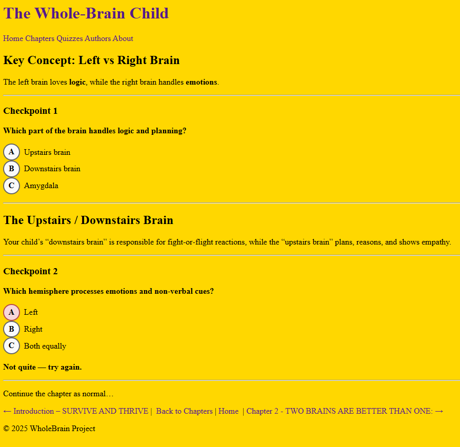

# Book And Quiz Template With Jekyll

I made this app mainly to show a working example of converting a book into a website with quizzes using Jekyll. This can be a great template to make future websites like: guides, cookbooks, etc. The books I chose were "Whole Brain Child" and "The Backyard Chicken Book: A Beginner's Guide"

To Run This App:
```bash
cd chickenGuide ; 
# Server Url Will Be In The Terminal, but it's http://localhost:4000
bundle exec jekyll serve
```

Images of Progress:


Added Nice Buttons:

