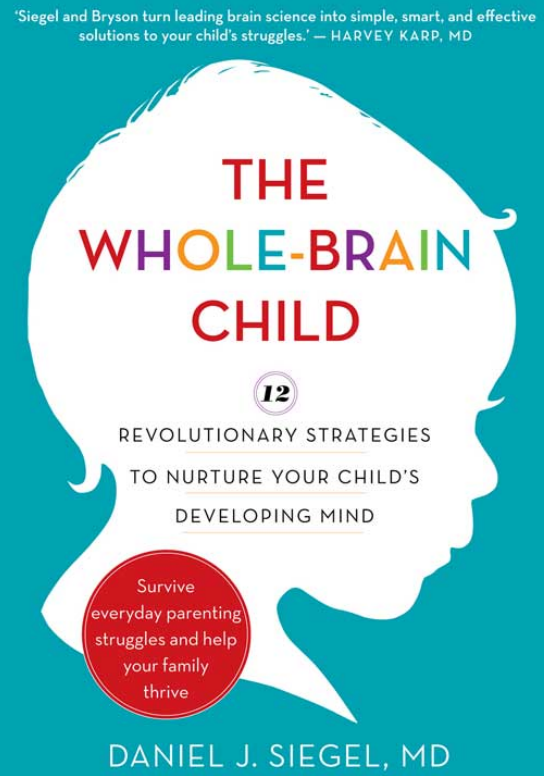

## Welcome!

**The Whole‑Brain Child** teaches parents how to help their children thrive by
integrating the “upstairs” logic brain with the “downstairs” emotional brain.
This site turns each chapter into a concise summary *plus* a quick quiz so you
can test your understanding as you read.

### How to use the site

1. **Read** the chapter summaries under *Chapters*.  
2. **Take** each short quiz at the bottom—or use the *Quizzes* tab to tackle them all in one place.  
3. **Check** the *Authors* tab to learn more about Daniel J. Siegel and
   Tina Payne Bryson.

Ready to begin? Head over to the [Chapters](/chapters/) page!
